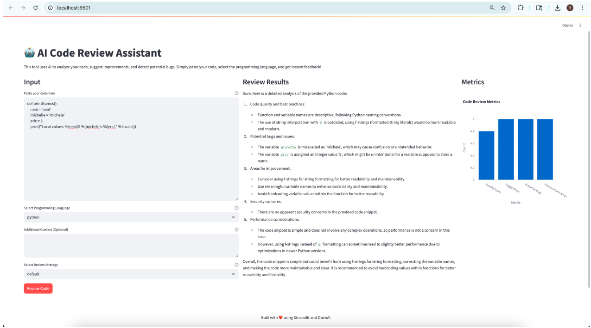

# AI_Code_Review_Assistant

An intelligent code review system that leverages Large Language Models (LLMs) to analyze code, suggest improvements, and detect potential bugs. Built with Streamlit for a simple and intuitive user interface.

## 📸 Interface Preview



## Features

- 🤖 AI-powered code analysis and suggestions
- 📊 Code quality metrics visualization
- 🔄 Automated code review suggestions
- 📱 Simple and intuitive web interface

## Project Structure

```bash
📦 ai-code-review-assistant/
 ┣ 📜 app.py                  # Streamlit frontend and backend
 ┣ 📜 prompts/                # Prompt templates for multiple review strategies
 ┣ 📜 .env.example            # Sample environment variables
 ┣ 📜 requirements.txt        # Python dependencies
 ┣ 📜 utils/                  # Helper functions and API wrappers
 ┣ 📜 mlops/                  # MLOps configs (MLflow, DVC, Prometheus)
 ┗ 📁 assets/                 # UI screenshots, charts
 ```
---

## 🧱 Architecture

| Layer                  | Component               | Description                                                             |
|------------------------|-------------------------|-------------------------------------------------------------------------|
| Input Processing       | Streamlit UI            | Accepts code, language, and review strategy                             |
| LLM Backend            | OpenAI GPT-3.5          | Generates contextual code feedback using custom prompt templates        |
| Vector Handling (opt.) | FAISS / LlamaIndex      | Used for retrieval-based enrichment (future expansion)                  |
| Review Engine          | Prompt Generator        | Formats code + strategy into LLM-ready prompt                           |
| Output Display         | Chart + Text Renderer   | Displays score + markdown-based feedback with metrics visualization     |
| MLOps Integration      | MLflow, DVC, Grafana    | Tracks experiments, versions prompts/data, and monitors inference usage |

---

## Setup Instructions

1. Clone the repository
2. Create a virtual environment and install dependencies:
   ```bash
   python -m venv venv
   source venv/bin/activate  # On Windows: venv\Scripts\activate
   pip install -r requirements.txt
   ```

3. Set up environment variables:
   ```bash
   cp .env.example .env
   # Edit .env with your OpenAI API key
   ```

4. Run the application:
   ```bash
   streamlit run app.py
   ```

## Usage

1. Open your web browser and navigate to the URL shown in the terminal (usually http://localhost:8501)
2. Paste your code in the input area
3. Select the programming language
4. (Optional) Add any additional context
5. Click "Review Code" to get AI-powered feedback

## MLOps Integration

The project can be integrated with MLOps tools:

- MLflow for experiment tracking
- DVC for data versioning
- Prometheus/Grafana for monitoring

## 📋 Example Use Case

```python
def printNames():
    neal = "neal"
    michele = "michlele"
    eric = 5
    print("Local values: %s %s %s" % (michele, neal, eric))
 ```
   
And get AI-powered feedback:

-Use f-strings instead of % formatting

-Fix typo in variable name michlele

-Avoid assigning int to a variable named like a person


